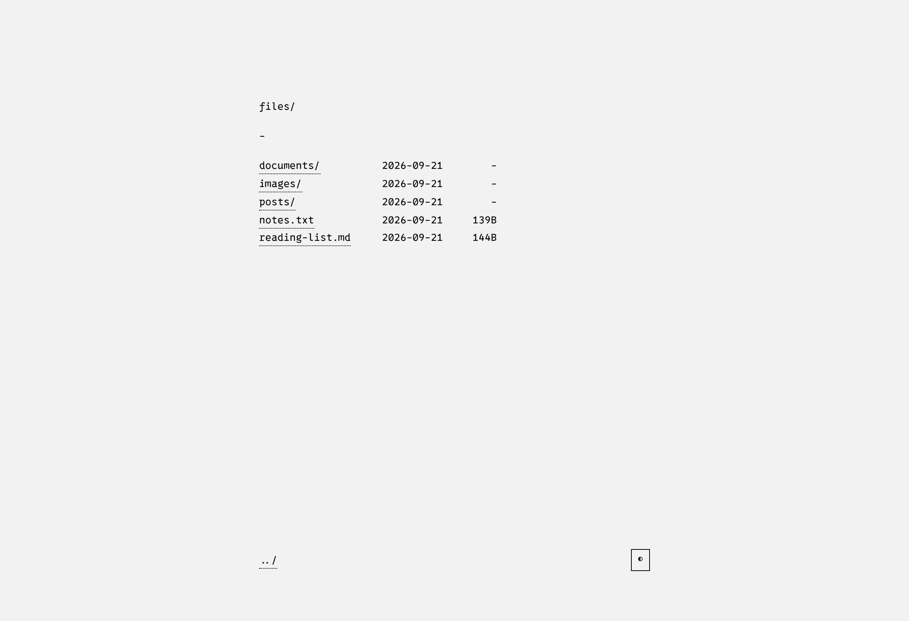
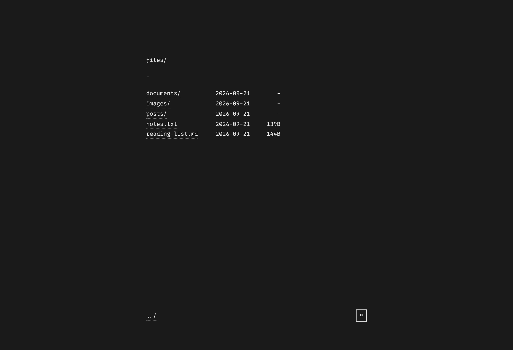
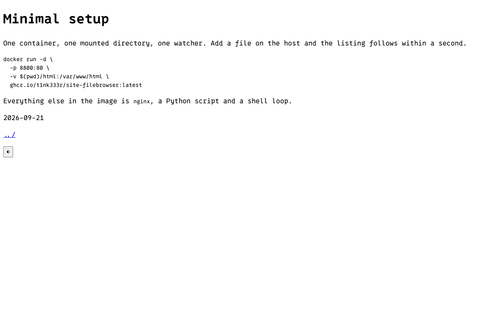

# Site FileBrowser

A minimal, self-hosted file browser. nginx serves a directory tree, a Python script
writes an `index.html` listing for every folder in it, and an inotify watcher keeps
those listings current as files change. Dark and light themes, no database, no
framework, no build step.

[](https://github.com/t1nk333r/site-filebrowser/actions/workflows/docker-publish.yml)
[](https://github.com/t1nk333r/site-filebrowser/tags)

## Screenshots

| Light | Dark |
| --- | --- |
|  |  |

A content page, in the theme it remembered from the last visit:



## Quick start

```bash
git clone https://github.com/t1nk333r/site-filebrowser.git
cd site-filebrowser

mkdir -p html/posts
echo "Hello" > html/posts/welcome.txt

docker compose up -d          # http://localhost:8800
```

To publish an existing folder instead, point the mount at it:

```bash
docker run -d -p 8800:80 -v /path/to/content:/var/www/html \
  ghcr.io/t1nk333r/site-filebrowser:latest
```

## How it works

- `generator.py` walks the content root and writes one `index.html` per directory:
  name-sorted, with sizes and dates, a parent link and a theme toggle.
- `watcher.sh` runs the generator on every change. It watches in monitor mode, so a
  change landing while a generation is running is queued rather than dropped, and it
  ignores its own output and hidden paths so it cannot wake itself.
- `nginx.conf` serves the result with a strict Content-Security-Policy and the usual
  hardening headers, no directory listing, no symlink following across owners, and
  the version hidden. `/healthz` answers `ok` for probes, and the image carries a
  `HEALTHCHECK` that polls it.

Content rules worth knowing:

- dotfiles, editor and backup files (`~`, `.bak`, `.old`, ...) and `index.html` are
  never listed, and nginx denies the first two as well
- an `index.html` you write by hand is never overwritten; the generator only
  replaces listings it wrote itself
- symlinks are followed only when they resolve inside the content root
- a file added to the tree shows up in the listing within about a second

## Creating content

```bash
./new-page.sh "My Blog Post" posts/my-post.html
python3 new-page.py "About Me" about.html
```

Both scaffolders write the same page from the same template, escape the title,
refuse to overwrite an existing file, and refuse paths that leave `html/`.
`html/template.html` is a full example page (headings, lists, code, quotes), and
`html.json` is the same template as a VS Code snippet for `minpage`.

Files need no scaffolding at all: copy them into `html/`.

## Configuration

| What | Where |
| --- | --- |
| Port | `ports` in `compose.yml` |
| Timezone | `TZ` in `compose.yml` |
| Excluded names | `EXCLUDE_PATTERNS` in `generator.py`; backup suffixes are mirrored in `nginx.conf` |
| Styles | `html/style.css` |
| Listings without Docker | `python3 generator.py html` |

## Theming

The button in the footer toggles light and dark. The choice is kept in
`localStorage`, so it survives navigation and comes back on the next visit, and an
`#dark` link still forces dark for that page and stays shareable.

## Testing

```bash
python3 -m venv .venv && . .venv/bin/activate
pip install -r requirements-dev.txt
playwright install chromium       # only for the browser tests

pytest                            # everything
pytest -m "not browser"           # skip the browser suite

docker build -t site-filebrowser:ci .
bash tests/smoke.sh site-filebrowser:ci
```

The suite covers link encoding for awkward filenames, exclusions, hand-written
listings, symlink policy, both scaffolders, the theme script (in every artefact that
carries it, plus a browser run) and `nginx.conf`. The smoke test boots the built
image and checks the runtime contract. CI runs both before publishing anything.

## Versions

Images are published to `ghcr.io/t1nk333r/site-filebrowser`:

- `latest`, `X.Y.Z` and `X.Y` - from a `vX.Y.Z` git tag, which is what you should pin
- `main` - the tip of the default branch
- `sha-<short>` - every build

`VERSION` holds the current release, and published images carry it in their
`org.opencontainers.image.version` label. To cut a release:

```bash
git tag "v$(cat VERSION)" && git push origin "v$(cat VERSION)"
```

## Security

There is no authentication and no upload path: the container serves exactly what is
in the mounted directory, so mount only what you mean to publish. Keep secrets
outside `html/`, and put it behind HTTPS or a proxy with auth (or bind it to
127.0.0.1) if it is reachable from anywhere untrusted. nginx runs unprivileged, and
generated files keep the host user's ownership.

Every response carries `Content-Security-Policy: default-src 'self'`, with
`object-src`, `base-uri`, `form-action` and `frame-ancestors` set to `none`, plus
`Referrer-Policy: no-referrer`, `X-Frame-Options: DENY` and a `Permissions-Policy`
that switches off the sensitive browser features. `script-src` and `style-src` keep
`'unsafe-inline'`, because the theme toggle, its `onclick` handler and the listing
styles are inline, while `eval` stays blocked and everything external falls back to
`'self'`. A page that needs an external font, image or frame has to name that source
in the policy in `nginx.conf`.

### Everything returns 403

The content directory has to be readable and traversable by the container's nginx
user, so run `chmod -R a+rX html` if the mount is more restrictive than `755`.

## Polish task list

Follow-ups that keep the project small while making it nicer to live with. Nothing
here is a known bug.

### Listing experience
- [ ] Client-side filter box for the current directory
- [ ] Sort by name, size or date
- [ ] Breadcrumb path instead of the lone `../`
- [ ] Total size for the directory in the footer
- [ ] Lazy thumbnails for image directories
- [ ] Emit `index.json` and render very large directories client-side (a 30 000-entry listing is a 3.4 MB page today)

### Theme
- [ ] Follow `prefers-color-scheme` on the first visit, with a "system" state
- [ ] `<meta name="color-scheme" content="light dark">` so scrollbars and form controls follow
- [ ] Inline SVG favicon, which silences the `/favicon.ico` 404s
- [ ] `aria-pressed` and a proper accessible name on the toggle, `scope` on the listing table

### Operations
- [ ] Periodic regeneration as a safety net behind the watcher
- [ ] Multi-root: one virtual top level over several mounts
- [ ] A "generate once, no watcher" mode for read-only content mounts
- [ ] Read exclusions from a file or the environment instead of editing `EXCLUDE_PATTERNS`

### Security
- [ ] Tighten `script-src` with a hash for the inline theme script, which needs the `onclick` handler turned into a listener first
- [ ] Note the proxy-side additions in the docs: HSTS, and the CSP entries an embedded video or external image would need

### Distribution
- [ ] Multi-arch images (`linux/amd64,linux/arm64`)
- [ ] `provenance` and `sbom` attestations on the published image

### Content
- [ ] Show a page's `<title>` instead of the filename for `.html` entries
- [ ] RSS/Atom feed for `posts/`
- [ ] Optional basic auth via environment variables
- [ ] Markdown rendering for `posts/*.md`, which needs a deliberate dependency decision

## License

Open source under the MIT License. Design inspired by
[williamjansson.com](https://williamjansson.com).
